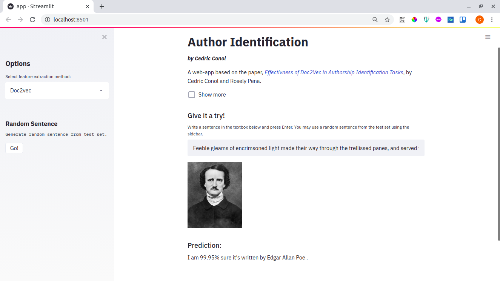

# Author Identification



A web-app from the paper, _[Effectivness of Doc2Vec in Authorship Identification Tasks](https://cedricconol.github.io/doc2vec/)_, by Cedric Conol and Rosely Peña.

### Prerequisites

Though not necessary, I advise using a virtual environment. 

### Installation

```
git clone https://github.com/cedricconol/author-identification
cd author-identification
pip install -r requirements.txt
```

### Running the app

```
streamlit run app.py
```

Alternatively, you may run it using the github link.
```
streamlit run https://raw.githubusercontent.com/cedricconol/author-identification/master/app.py
```
